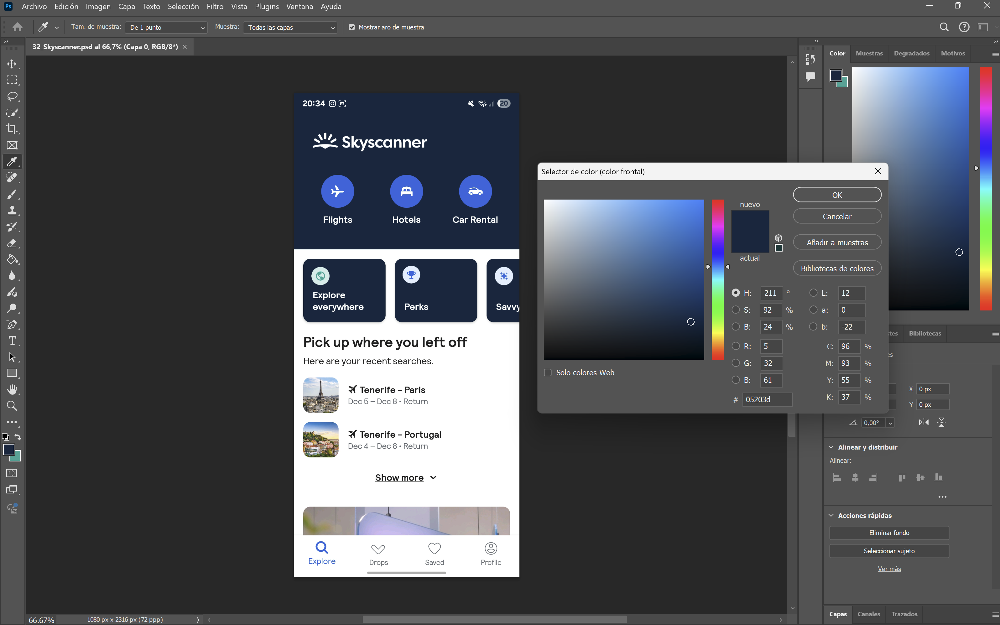

1. **Utiliza alguna herramienta para obtener el código de cada color** utilizado en la aplicación y **guárdalos en un fichero de TypeScript** para los colores de tu aplicación.

   Yo he obtenido el código de cada color de la app con *Photoshop CC 2024*. Cada color lo he almacenado en una **variable estática** en el documento `CardsColors`, que se colocó en la carpeta `constants` del repositorio.

