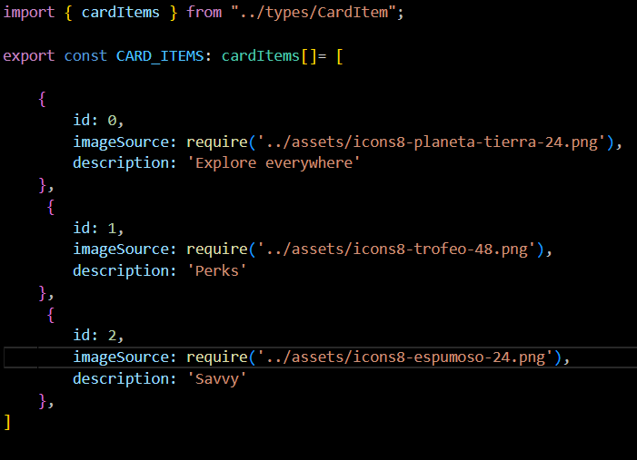

3. Explica, apoyándote en el código, como has realizado la implementación de algún
componente propio.

Voy a tratar de explicar el componente BodyCard, lo que lo compone, cómo lo implementé y su funcionalidad.

Primero que nada, el componente consta de un "Type CardProps" que son el cuerpo de las props, propias del propio BodyCard, un atributo imagen, otro llamado descripción que luego procederemos a desestructurar más adelante dentro del componente BodyCard, porque nos interesa que según el objeto a mostrar, esas props cambien, en este caso nos interesa hacer el mismo cuadrado pero con diferentes imágenes y descripciones.

Luego vendría siendo el componente BodyCard que es constante, a la que se le paasan las props y son desestructuradas para llamarlas en la estructura del componente. Tenemos varios Views, el que forma la caja donde van a ir el resto de Views, hacemos un cuadrado con el View, "card_container", le establecemos una altura de 140 píxeles y 170 de ancho, lo cual genera un cuadrado perfecto, con un color de fondo azul oscuro, nos interesa que tenga la propiedad flex ya que nos permite adaptar el contenido según las necesidades, establecemos un margin 20 para que el contenido no esté pegado al borde del cuadrado y pueda mantener un estilizado, el flex-end para que todos los textos estén pegados al margin establecido abajo del todo.

Seguimos con el View "circle" y dentro una imagen. El contenedor con la propiedad de strilos "circle" simplemente se encarga de generar un círculo más grande que la imagen estableciendo 40 píxeles de alto por ancho, mantenmos centrada la imagen tanto horizontal como vertial con "justifyConten:Center" y "alignItems:Center", establecí unos márgenes para centrar el círculo con la imagen en la esquina superior, luego le añadí la propiedad "borderRadius" dividiendo el tamaño total entre dos para que sea ciruclar y no cuadrada, luego una variable de color CYAN_MUY_CLARO para que tenga ese color de fondo. La imagen se le pasa el prop "imageSource" que en el app nos encargaremos de utilizar para que depende del objeto en el scrollview muestre una imagen u otra. A la imagen le di la propiedad "tintColor:CardColors.AZUL_MARINO", para que la imagen adoptara el color que le di y le asigné un tamaño de 25 píxeles de alto por ancho.

Luego tenemos el View "text_container" al que solo le doy estilos y para adecuarlo al cuadrado.

Por último, uso la propiedad font para darle el formato de color, tamaño y negrita al texto. Pasándole la prop desestructurada "descripción" como texto ya que al igual que con la imagen, cada objeto creado tendrá su propio texto e imagen creada.

 

De último, el app, utilicé un ScrollView donde dentro irían los objetos de BodyCard ya que quiero renderizar en función de si están en pantalla o si directamente no hay objetos que mostrar. Indiqué que el scroll fuera lateral para poder mostrar contenido debajo con "showsHorizontalScrollIndicator={false}" y un tamaño de altura máximo de 180 píxeles. dentro del ScrollView llamé a un array de objetos que exporté de CardItems.ts llamado CARD_ITEMS, allí simplemente almaceno los objetos a los que llamaré para desesctructurarlos más adelante en "imagenSource" y "descripción". Creé una condición con CARD_ITEMS.length > 0 ?():() que implica que si el array de objetos CARD_ITEMS su longitud es mayor a 0, se renderizan los elementos del interior, si la longitud es 0, es decir, es un array vacío y no hay nada que mostrar, entonces mostraría que "no hay cards que mostrar". En nuestro caso tenemos tres objetos dentro del array CARD_ITEMS en el archivo CardItems.ts que se componen por el id, la clave maestra que permitirá diferenciar un objeto de otro por el map que más tarde usaremos para ordenar los objetos. el imageSource y la descripción que cada uno tiene. Entonces a CARD_ITEMS le pasamos un map que permite ir de uno en uno recorriendo ese array renderizando cada objeto diferente del interior siendo reutilizables, aprovechamos y llamamos al componente BodyCar con la estructura del objeto montada, y pasando por parámetro cada imagen y descripción del objeto card que el map recorre del array CARD_ITEMS.
